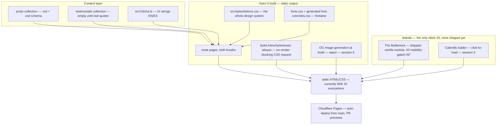

# System architecture

## Overview

Static site, no application server. Content lives in Astro Content Collections validated by zod schemas; the build emits plain HTML/CSS with near-zero JavaScript; the only client JS is a short allowlist of Astro islands. **State: Sessions 1–2 built and gates-green** — scaffold (tokens/fonts/layout/i18n/CI) plus the complete bilingual homepage (hero, thesis, whoami, proof ×4, services ladder, ideas ×2, footer CTA; testimonials omitted per rule) with the full motion system. The Bottleneck signature element SHIPPED (session 3 — see [[signature-element-bottleneck]]); service/blog/etc. templates, OG generation, and Plausible are NOT built yet.

## Module graph

## Information architecture

Routes (EN default at `/`, ES mirror under `/es/` — [[en-default-locale]]):

- `/` and `/es/` — homepage (complete, both locales, Bottleneck live in the thesis section)
- `/services/{diagnostic,fractional,coaching}` ↔ `/es/servicios/{diagnostico,fractional,coaching}` — session 4
- `/principles/` ↔ `/es/principios/` — session 4
- `/ideas/` and `/ideas/[slug]/` ↔ `/es/ideas/` — session 4 (translations cross-linked)
- `/about/` ↔ `/es/sobre-mi/`; `/contact/` ↔ `/es/contacto/` — session 5
- `/now/` — optional, phase 2

Locale switcher persists the equivalent page (generic `/es` prefix swap in `src/i18n/utils.ts`; localized slugs like `/es/servicios/…` need an explicit map when those routes land — TODO noted in code). hreflang pairs on every page; sitemap covers both locales. The old blog stays at i.usedtocode.com as the archive, linked from the `/ideas/` footer ([[old-site-archive-no-migration]]).

## Constraints

- Static output; JS budget ≤30KB total on the homepage, 0KB on blog posts ([[performance-as-design-feature]]).
- Islands only for: language-aware header (if needed), The Bottleneck, Calendly loader ([[astro-5-static-islands]]).
- One design-tokens file is the entire styling system; no Tailwind ([[vanilla-css-design-tokens]]).
- Fonts: `optional` + metric-matched fallbacks + selective preload — do not revert to `swap` ([[font-loading-strategy]]); Lighthouse CI uses devtools throttling ([[lhci-devtools-throttling]]).
- Publishing a post = adding one .md file and pushing — no other steps.
- Testimonials section renders only with ≥3 real quotes ([[testimonials-real-or-omitted]]).
